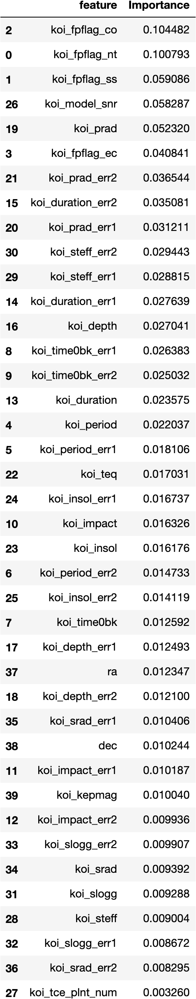
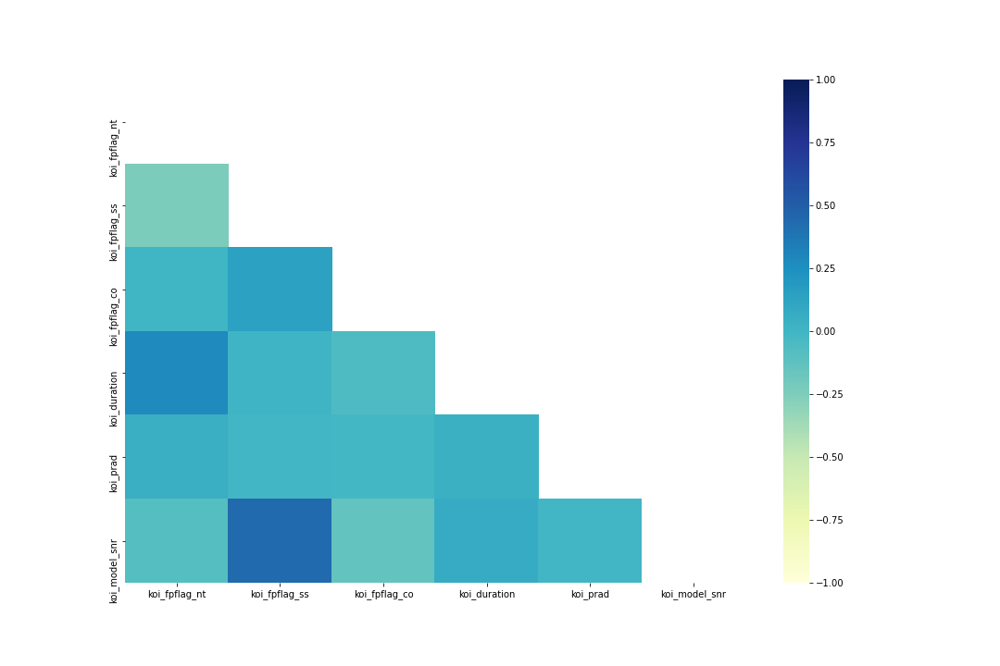

# machine-learning-challenge
# Exoplanet Exploration


Created by [Celeste Muniz - Lithgow](https://github.com/celeste1030)

## Table of Contents
* [About](#about)
* [Source](#source)
* [Preprocessing the Data](#preprocessing-the-data)
* [Fit and Tune Model Parameters](#fit-and-tune-model-parameters)
* [Compare Models](#compare-models)
* [Technologies](#technologies)

## About

Over a period of nine years in deep space, the NASA Kepler space telescope has been out on a planet-hunting mission to discover hidden planets outside of our solar system.

To help process this data, I created machine learning models capable of classifying candidate exoplanets from the raw dataset.

## Source

[Exoplanet Data Source](https://www.kaggle.com/nasa/kepler-exoplanet-search-results)

## Preprocessing the Data
### EDA (Exploratory Data Analysis)
To explore the dataset and decide what to keep, I used visuals to observe properties of all of the columns in the dataframe.

### Seaborn Heat map


I chose to use a Seaborn heat map to explore the data because it's useful way to see which columns are similar to each other. Columns that appear darker blue show that they are closely correlated to the column its paired with.  Columns that are too similar to each other may need to be deleted.  Many of these columns are margin of error columns.

### Histogram(s)


I explored the frequency of my X data by creating an army of histograms with pandas.  These histograms show me the frequency of attributes in each column which helps me narrow down what to keep for my model.  The more evenly distributed an attribute is, the more likely I am to keep it.


I also made a histogram for my y values.  This was useful to reference towards the end to see which y value needed to have the highest precision.  Later when I [compare models](#compare-models), "false positive" does have the highest precision showing that our model is useful for predicting the most frequent y value.

### Importances



I used Sklearn Random Forest Classifier to create a data frame of all of the features sorted by their importance.  I chose to keep most features with importances higher than .02.

* Perform feature selection and remove unnecessary features.

I chose to drop all margin of error columns, all columns that were under the importance level of 0.02, and anything that was too similar to another column while keeping all of the ones that were of higher importance.

Then, I did another Seaborn heat map to see if I had any features that were too similar to other features.



Nothing too similar here!

### Splitting

Used Sklearn train_test_split to separate data into training and testing data.

```
from sklearn.model_selection import train_test_split
target = df["koi_disposition"]
X_train, X_test, y_train, y_test = train_test_split(X, target, random_state=42)
X_train
``` 

### Scaling

I used Sklearn StandardScaler to scale the training and test data.

```
from sklearn.preprocessing import StandardScaler
X_scaler = StandardScaler().fit(X_train)
X_train_scaled = X_scaler.transform(X_train)
X_test_scaled = X_scaler.transform(X_test)
```

## Fit and Tune Model Parameters
### Model 1
**GridSearch**


### Model 2
**Random Forest Classifier**


### Model 3
**Decision Tree Classifier**


## Compare Models

* **Model 2** is the most accurate model with an accuracy of **88%** compared to Model 1 (81%) and Model 3 (83%).
* **Model 2** out performed Model 1 and Model 3 in recall, fscore, support and, most significantly, precision.
* Precision was similar for "false positive" for all models, while precision for "confirmed" and "candidate" were significantly higher in **Model 2**. Model 2's precision for "candidate" is almost 20% higher than Model 1.

|model(M)|label|precision|
|--------|-----|---------|
|M1|CANDIDATE|0.61| 
|M1|CONFIRMED|0.70|  
|M1|FALSE POSITIVE|0.98|
|**M2**|CANDIDATE|**0.78**| 
|**M2**|CONFIRMED|**0.80**|  
|**M2**|FALSE POSITIVE|**0.98**|
|M3|CANDIDATE|0.67| 
|M3|CONFIRMED|0.73|  
|M3|FALSE POSITIVE|0.96|


## Technologies
* Scikit-Learn
* Python
* Jupyter Notebook